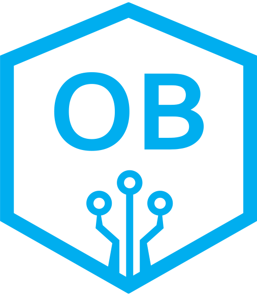

<!-- PROJECT LOGO -->
<p align="center">
  <a href="https://github.com/IncudoLABS/orions-belt">
   
  </a>
</p>

# Orion's Belt: A Framework for Principled, Automated System Hardening

Orion's Belt is an open-source collection of metadata-driven Ansible playbooks designed to automate system hardening and security compliance. Our goal is to provide a robust, community-vetted library of scripts mapped to established cybersecurity benchmarks like CIS, NIST CSF, and ISO 27001.

## Our Approach

While many configuration scripts exist, creating a truly robust, reliable, and adaptable hardening solution presents significant technical challenges. Standard approaches often result in brittle, platform-specific scripts that are difficult to maintain and verify. Our work on Orion's Belt is focused on overcoming these systemic issues through three key areas of investigation:

1.  **Developing a Flexible Hardening Architecture:** We are engineering a modular framework for Ansible that moves beyond static, hard-coded configurations. The primary technical challenge is designing an architecture that is truly platform-agnostic and remains idempotent across a vast and unpredictable range of target environments.

2.  **Systematic Translation of Controls to Code:** We are developing a systematic methodology to translate high-level security requirements into concrete, verifiable automation tasks. This involves creating a logical model to manage dependencies between controls and ensure that automated remediation is both effective and non-disruptive.

3.  **Investigating AI-Assisted Generation:** We are exploring novel techniques for leveraging AI to assist in the development of hardening playbooks, including new validation and verification strategies to overcome the inherent limitations of current AI models.

Our development is continuously guided by these core research principles.

## Key Features

*   **Framework-Aligned:** Each playbook is mapped to specific controls from well-known security frameworks, providing clear context for compliance.
*   **Metadata-Driven:** Scripts are self-documenting, with rich metadata defining their purpose, target systems, and version.
*   **Community-Vetted:** We use a transparent, multi-stage review process via our `contrib` branch to ensure high-quality contributions.
*   **Enterprise-Ready:** Contributions undergo a rigorous internal testing and enrichment pipeline to ensure they are robust and secure for enterprise use.
*   **Extensible by Design:** The project is structured to support hardening across different operating systems, network devices, and cloud environments.

## Getting Started

This project uses a flexible, environment-based configuration system. To get started, you will need to create configuration and inventory files for your target environment (e.g., `development`, `staging`, `production`).

The runner script (`run_playbooks.sh`) will automatically load the correct files based on the selected environment.

For detailed instructions, setup guidance, and a full walkthrough with examples, please see our comprehensive **[Configuration System Usage Guide](example_usage.md)**.

A basic first-time setup for a `development` environment would look like this:

```bash
# 1. Create the necessary directories
mkdir -p config inventory

# 2. Create a development configuration file
cp config/config-example.yml config/config-development.yml

# 3. Create a development inventory file
cp inventory/hosts-example inventory/hosts-development

# 4. Edit the new files to match your environment
# nano config/config-development.yml
# nano inventory/hosts-development

# 5. Run the script for the development environment
./run_playbooks.sh development
```

## How to Contribute

We welcome contributions from the community! Our development model is centered around the `contrib` branch, where new ideas and scripts are submitted and reviewed.

For detailed instructions on how to prepare your script, format your pull request, and navigate our review process, please read our **[CONTRIBUTING.md](CONTRIBUTING.md)** file.

## License

This project is licensed under the GPLv3 License. See the [LICENSE](LICENSE) file for details.